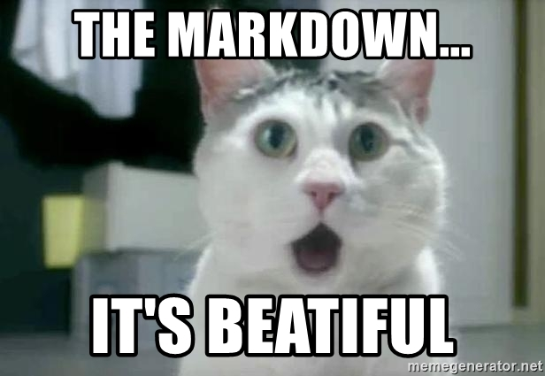

# Paola

# Github Flavoured Markdown

## Checkbox
- [x] [External Link](#External-Link)
- [x] [Internal Link](#Internal-Link)
- [x] [Images](#Images)
- [x] [Emojis](#Emojis)
- [x] [Tables](#Tables)

## External Link
You can find the github documentation [GitHub documentation](https://help.github.com/en)

## Internal Link

## Images
Here you can find the [images folder](images)

## Emojis
:cat:\
:heart_eyes_cat:\

## Tables
| Name | Class| 
|:---------|--------:|
| Giorgio | E0E2 | 
| Vanesa  | E0E1 | 
